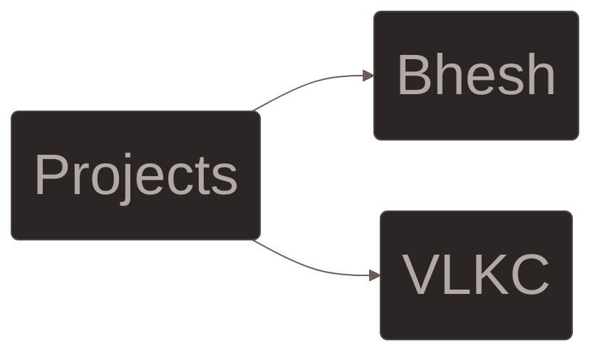

****🔳 Level 18+ zleDev 🔺****<br>
**Details**<br>
**HP: 80/100**<br>
**Nature: Chill**<br>
**Gender: Male**<br><br>
**More Info**<br>
- **🌱 Learning and growing every day**<br>
- **📚 Studying Electronics Engineering**<br>
- **🇵🇭 From the Philippines | Ako ay Pilipino**<br>
- **🇯🇵 Knows Japanese N4 | 日本語が理解できます**<br>



```diff
- Give up, you're not talented enough.
+ Talents are worthless without hard work.
```
__Main Languages:__ 


#
